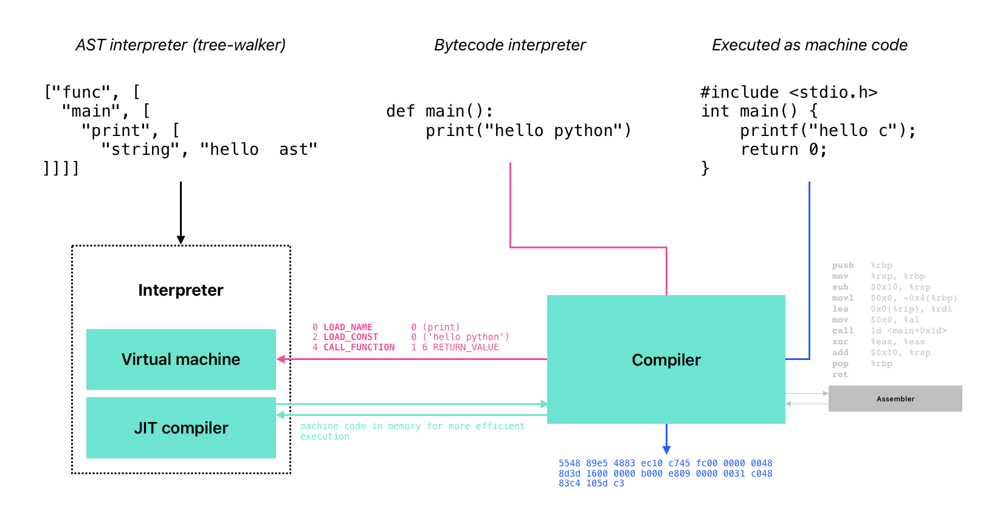
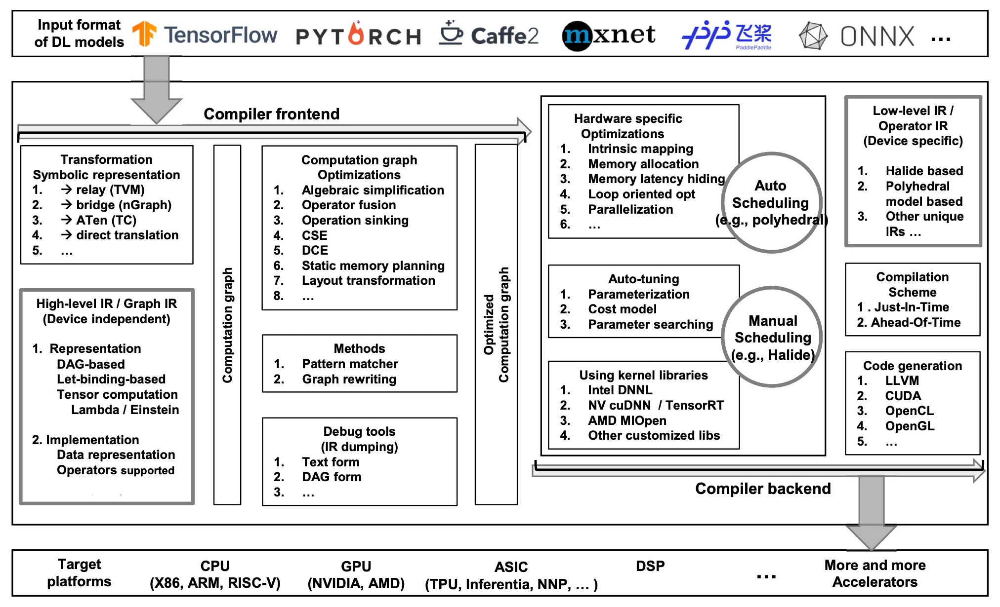

Headers with <mark>recently changed</mark> indicate sections that have been updated recently.

## High-level observations (AI/ML landscape)

Model training is compute-intensive and model inference is latency-sensitive. More powerful chips result in better models, so demand likely to increase for as long as "better" models justify the cost of training.

Inference scale with users (connected devices), but will inference be as important as training? Is training new models going to slow down in favor of applications (inference)? [Pete Warden thinks so](https://petewarden.com/2023/09/10/why-nvidias-ai-supremacy-is-only-temporary/) (but ml community is undecided).

Chips for training is made and sold by Nvidia. AMD have tried with Ryzen AI and Instinct but revenue growth is mostly flat (no demand, management issue?, or bad software?). TSMC is de-facto monopoly for chip manufacturing.

Google's TPU is an inference ASIC made by broadcom and only available via cloud. AWS Inferentia is the competition (also an inference ASIC available via cloud). Coreweave is a GPU cloud startup and [backed by Nvidia](https://www.reuters.com/markets/deals/nvidia-backed-coreweave-seeks-stake-sale-up-8-billion-valuation-bloomberg-news-2023-08-30/) ). Lambda Labs is another GPU cloud startup worth following.

OpenAI train large closed-source models (for language or otherwise) and expose via API. HuggingFace host open-source datasets and pre-trained models (trained weights are learned parameters specific to a dataset).

Midjourney is an end-to-end application using it's own proprietary model. Github Copilot is an end-user application using GPT-3 (trained by OpenAI).

## Interpreters and compiler runtimes



### Stack vs register-based

```
x = 15
x + 10 - 5
```

```
[program, [
    [assign, x, 15],
    [sub,
        [add, x, 10],
        5
    ]
]]
```

An AST interpreter evaluates the tree directly (i.e. tree walker, visitor). A bytecode interpreter (VM) translates tree to bytecode then evaluates bytecode.

A stack-based VM is stack structure with operands, operators are applied to top-most items in stack, result is top item in stack (no registers):

```
push    $15     ; push 15 to stack
push    $10     ; push 10 to stack
add             ; add top two elements of stack (15 + 10)
push    $5      ; push 5 to stack
sub             ; subtract top two elements of stack (25 - 5)
```

A register-based VM store values in virtual registers, result in accumulator (virtual registers are mapped to real registers by register allocator):

```
mov     r1, $15 ; move 15 to register 1
add     r1, $10 ; add 10 to register 1 (15 + 10)
sub     r1, $5  ; subtract 5 from register 1 (25 - 5)
```

The `dis` module in Python can be used to disassemble Python bytecode:

```python
import dis

def f(x):
    x = 15
    return x + 10 -5

dis.dis(f)
# 3           0 RESUME                   0

# 4           2 LOAD_CONST               1 (15)
#             4 STORE_FAST               0 (x)

# 5           6 LOAD_FAST                0 (x)
#             8 LOAD_CONST               2 (10)
#            10 BINARY_OP                0 (+)
#            14 LOAD_CONST               3 (5)
#            16 BINARY_OP               10 (-)
#            20 RETURN_VALUE
```

### Compiler vs interpreter

Compilers delegate evaluation to lower-level programming languages (i.e. translate AST to IR or machine code):

- ahead-of-time (AOT) compiler translates all code to machine code
- just-in-time (JIT) compiler generates machine code at runtime (e.g. caching functions for future calls)
- AST transformer or transpiler translates AST to AST (e.g. convert Python to JavaScript)

Use `clang++ main.cpp -S -emit-llvm -O0` in C++ to generate LLVM IR:

```cpp
int main() {
    int x = 15;
    return x + 10 - 5;
}
```

```llvm
define i32 @main() #0 {
    %1 = alloca i32, align 4
    %2 = alloca i32, align 4
    store i32 0, i32* %1, align 4
    store i32 15, i32* %2, align 4
    %3 = load i32, i32* %2, align 4
    %4 = add nsw i32 %3, 10
    %5 = sub nsw i32 %4, 5
    ret i32 %5
}
```

Interpret LLVM IR and output result `lli main.ll; echo $?` (output should be `20`). Compile to LLVM bytecode, interpret, and output result `llvm-as main.ll; lli main.bc; echo $?`. Generate object file and execute `llc -filetype=obj main.bc; clang++ main.o -o main; ./main; echo $?`.

## <mark>recently changed</mark> LLVM "backend"


The LLVM backend is series of steps performed to translate the LLVM IR to machine code for a specific target (e.g. x86-64, ARM, WebAssembly):

- LLVM IR is the portable representation in SSA form
- DAG of operations (graph of operations)
    - Legalized DAG is DAG with only legal operations (e.g., no multiplication)
    - Optimized DAG is DAG with optimized operations (constant folding, dead code elimination)
- Instruction selection is mapping operations to target-specific instructions (e.g. x86-64 `add` instruction)
    - Scheduling and emitting instructions (e.g. x86-64 `add` instruction is `addq`)
- Register allocation is mapping virtual registers to physical registers (e.g. x86-64 `rax` register)
- Native code generation is generating machine code (e.g. x86-64 `addq` instruction is `48 83 c0 0a`)
    - Emitting machine code (e.g. x86-64 `48 83 c0 0a` is `addq $10, %rax`)


Compile LLVM IR to specific target with `llc -march=x86-64 main.ll`, see `llc --version` for list of targets.

## MLIR

LLVM is CPU-focused lower-level optimization back-end for traditional programming languages. MLIR is LLVM for machine learning models (e.g. optimizations on graphs).

MLIR have IRs at different abstraction levels (dialects):

- tensor operators [TOSA](https://mlir.llvm.org/docs/Dialects/TOSA/)
- linear algebra [linalg](https://mlir.llvm.org/docs/Dialects/Linalg/)
- low-level control flow [cf](https://mlir.llvm.org/docs/Dialects/ControlFlowDialect/)

In MLIR, multiple lowering passes incrementally translate higher-level IRs to lower-level IRs until reaching LLVM IR (or machine code):

- optimizations can be applied at different levels
- higher-level dialects mainly useful to make it easier to write "optimization passes" (IR-rewriting modules, same as lowerings)

### MLIR operations

```mlir
func.func @main(%arg0: i32) -> i32 {
    %0 = math.ctlz %arg0 : i32
    func.return %0 : i32
}
```

In MLIR, [func](https://mlir.llvm.org/docs/Dialects/Func/) is a dialect for function abstractions and [math](https://mlir.llvm.org/docs/Dialects/MathOps/) is a dialect for mathematical operations ([ctlz](https://mlir.llvm.org/docs/Dialects/MathOps/#mathctlz-mathcountleadingzerosop) is operation to count leading zeros):

- `%arg0` is the integer argument to `ctlz`
- multiple dialects can be used in a single program (progressively lowered to backend target)

## Accelerating ML models

### PyOpenCL

Testing on Macbook Pro (2019):

```shell
>>> import pyopencl
>>> from pyopencl.tools import get_test_platforms_and_devices
>>> get_test_platforms_and_devices()
[(<pyopencl.Platform 'Apple' at 0x7fff0000>, [<pyopencl.Device 'Intel(R) Core(TM) i9-9880H CPU @ 2.30GHz' on 'Apple' at 0xffffffff>, <pyopencl.Device 'Intel(R) UHD Graphics 630' on 'Apple' at 0x1024500>, <pyopencl.Device 'AMD Radeon Pro 5500M Compute Engine' on 'Apple' at 0x1021e00>])]
```

OpenCL via `pyopencl` seems to work fine on Macbook using AMD (see [sobel filter using opencl](/code/python/misc/sobel-filter-using-opencl.html)).

### CUDA

An example CUDA kernel to add two arrays:

```cpp
__global__ void add(float* a, float* b, float* result, int size) {
    int idx = blockIdx.x * blockDim.x + threadIdx.x;
    if (idx < size) {
        result[idx] = a[idx] + b[idx];
    }
}
```

### Hand-writing tensor functions

Operator fusion (linear and relu into linear-relu):

```python
# input tensor: (1, 3072)
# output tensor: (1, 200)
def linear_relu(x, w, out):
    for i in range(1):
        for j in range(200):
            out[i, j] = 0
            for k in range(3072):
                # linear                
                out[i, j] += x[i, k] * w[j, k]
            # relu
            out[i, j] = max(out[i, j], 0)
```

Rewriting in lower-level programming languages:

```python
def add(a, b, c):
    for i in range(128):
        c[i] = a[i] + b[i]
```

```cpp
void add(float* a, float* b, float* c) {
    for (int i = 0; i < 128; i++) {
        c[i] = a[i] + b[i];
    }
}
```

Linear, add, relu, softmax (and other primitives) often implemented in low-level languages like C/C++ and assembly.

### Other techniques and tools



- graph optimization
    - constant folding, pruning, dead code elimination
    - [TensorFlow's Graph Transform Tool](https://github.com/tensorflow/tensorflow/blob/master/tensorflow/tools/graph_transforms/README.md)

- kernel selection
    - pick best kernel for operation (i.e. hardware-specific implementation for an operation)
    - quantized kernels (computing on lower-precision data types)
    - [Nvidia's cuDNN](https://developer.nvidia.com/cudnn)

- auto-tuning
    - find best kernel or kernel parameters (e.g. using genetic algorithms or reinforcement learning)
    - [TVM's GA tuner](https://github.com/apache/tvm/blob/main/python/tvm/autotvm/tuner/ga_tuner.py)

- code generation
    - machine code and hardware-specific instructions (LLVM, XLA, WASM, WebGPU)
    - runtime environment and hardware-specific tuning (CUDA, OpenCL)

## Misc

### Abstract analysis

Abstract analysis, or [abstract interpretation](https://en.wikipedia.org/wiki/Abstract_interpretation), to find general answers to questions without precise answers:

- "is this program correct?" (yes or no?)
- "what is the value of this variable?" (without running the program)

```python
import ast
import inspect

def factorial(n):
    if n == 0:
        return 1
    else:
        return n * factorial(n - 1)

# abstract analysis
def abstract_analysis(func):
    if any(isinstance(node, ast.BinOp) and isinstance(node.op, ast.Mult) for node in ast.walk(ast.parse(inspect.getsource(func)))):
        return "function involves multiplication"
    return "no multiplication"

print(abstract_analysis(factorial))
# function involves multiplication
```

### Kolmogorov complexity

The [Kolmogorov complexity](https://en.wikipedia.org/wiki/Kolmogorov_complexity) of a output is length of shortest program that can produce the output

- `abababababababababababababababab` can be produced by `print("ab" * 16)`
- `4c1j5b2p0cv4w1x8rx2y39umgw5q85s7` can be produced by `print("".join(random.choices(string.ascii_lowercase + string.digits, k=32)))` or `print("4c1j5b2p0cv4w1x8rx2y39umgw5q85s7")`
